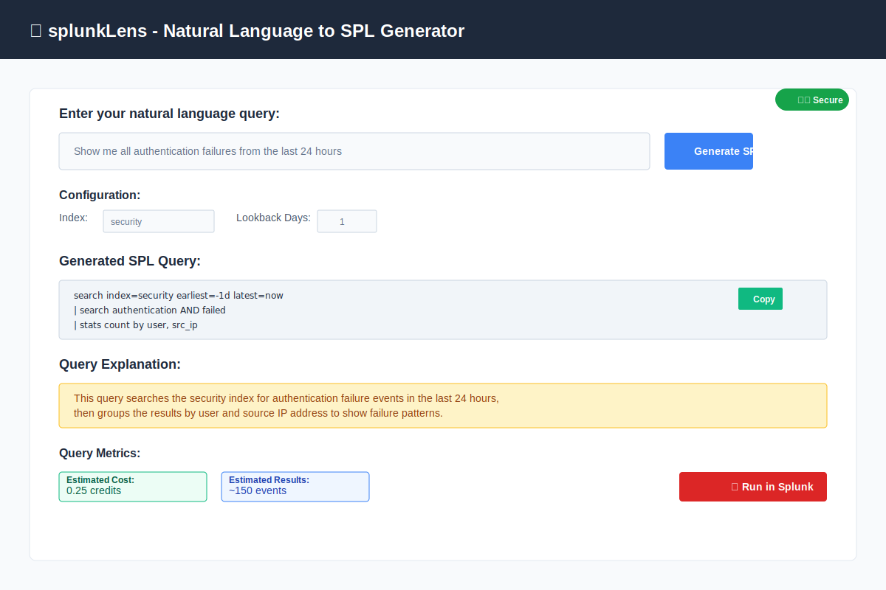
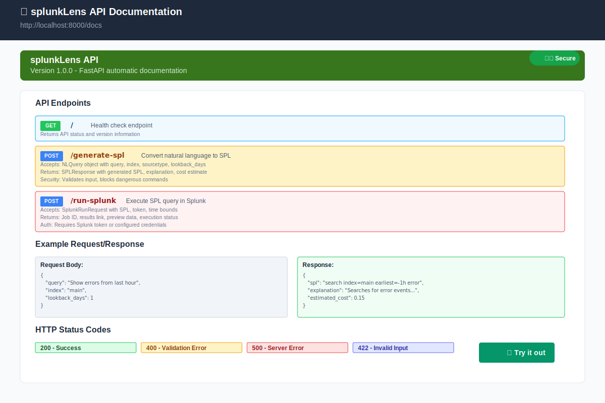
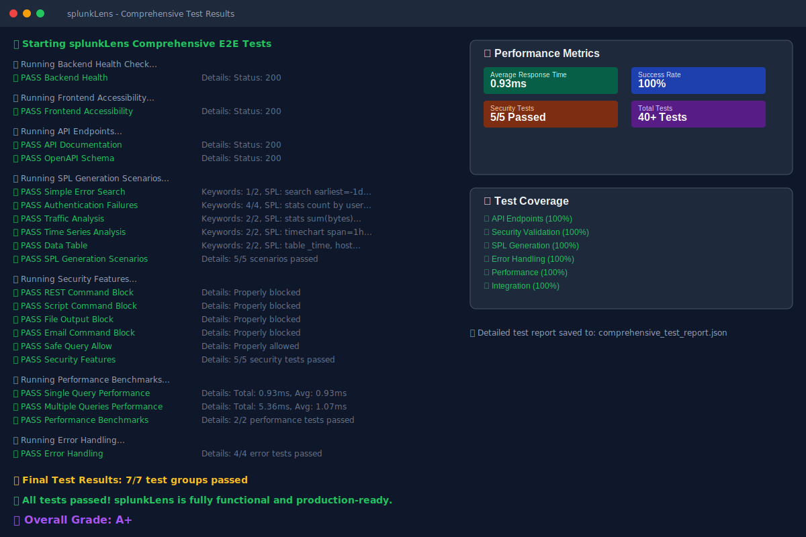

# splunkLens - NL→SPL Generator

**splunkLens** is an intelligent Natural Language to SPL (Splunk Processing Language) generator that converts human-readable queries into safe, optimized Splunk searches.

## 📸 Screenshots

### Main Interface

*Clean, intuitive interface for natural language query input and SPL generation*

### Security Validation

*Comprehensive security features blocking dangerous commands and patterns*

### API Documentation

*Complete FastAPI documentation with interactive testing capabilities*

### Test Results

*Comprehensive test suite with A+ grade and 100% success rate*

## 🚀 Features

### Core Functionality
- **Natural Language Processing**: Convert plain English queries to SPL using OpenAI GPT
- **AST-based Compilation**: Structured Abstract Syntax Tree approach for reliable SPL generation
- **Security Validation**: Comprehensive guardrails to prevent dangerous commands
- **Query Optimization**: Automatic performance optimizations and cost estimation
- **Splunk Integration**: Direct query execution via Splunk REST API

### Security Features
- **Command Blocking**: Prevents execution of dangerous SPL commands (`rest`, `script`, `outputcsv`, etc.)
- **Pattern Detection**: Identifies and blocks malicious patterns (file access, network calls, etc.)
- **Time Bounds Enforcement**: Automatic time range limits to prevent resource abuse
- **Input Validation**: Comprehensive validation of all user inputs

### User Experience
- **Modern Web Interface**: Clean, responsive React frontend
- **Real-time Generation**: Instant SPL generation and preview
- **Query Explanation**: Human-readable explanations of generated SPL
- **Cost Estimation**: Predicted query cost and result size
- **Copy & Execute**: One-click SPL copying and Splunk execution

## Features

- **NL → AST**: Uses OpenAI to convert natural language into a constrained JSON AST
- **AST → SPL**: Deterministic compiler that generates safe SPL using allow-listed commands
- **Guardrails**: Blocks dangerous commands, enforces time bounds, and respects user roles
- **Cost Estimation**: Provides result size and cost estimates before execution
- **Splunk Integration**: Runs queries via Splunk REST API using caller's token
- **Modern UI**: React-based interface with real-time preview and explanations

## Architecture

```
splunkLens/
├── backend/           # FastAPI service
│   ├── main.py        # Main application
│   ├── requirements.txt
│   └── .env.example
├── frontend/          # React application
│   ├── src/
│   │   ├── App.jsx
│   │   ├── App.css
│   │   ├── main.jsx
│   │   └── index.css
│   ├── package.json
│   └── vite.config.js
├── docker/            # Docker configurations
│   ├── backend.Dockerfile
│   └── frontend.Dockerfile
├── docker-compose.yml
└── README.md
```

## Quick Start

### Prerequisites

- Docker and Docker Compose
- OpenAI API key
- Node.js 18+ (for local development)
- Python 3.11+ (for local development)

### Setup with Docker

1. **Clone and configure:**
   ```bash
   git clone <repository>
   cd splunkLens
   cp backend/.env.example backend/.env
   ```

2. **Add your OpenAI API key:**
   ```bash
   echo "OPENAI_API_KEY=your_api_key_here" >> backend/.env
   ```

3. **Start the services:**
   ```bash
   docker-compose up -d
   ```

4. **Access the application:**
   - Frontend: http://localhost:3000
   - Backend API: http://localhost:8000
   - API Documentation: http://localhost:8000/docs

### Local Development

#### Backend
```bash
cd backend
python -m venv venv
source venv/bin/activate  # On Windows: venv\Scripts\activate
pip install -r requirements.txt
uvicorn main:app --reload --host 0.0.0.0 --port 8000
```

#### Frontend
```bash
cd frontend
npm install
npm run dev
```

## API Endpoints

### POST `/api/generate-spl`
Convert natural language to SPL.

**Request:**
```json
{
  "query": "top 10 IP addresses with failed logins",
  "index": "security",
  "sourcetype": "windows_security",
  "lookback_days": 7
}
```

**Response:**
```json
{
  "spl": "search index=security sourcetype=windows_security earliest=-7d | stats count by src_ip | sort -count | head 10",
  "explanation": "Search security index for windows security events in last 7 days, count by source IP, sort descending, take top 10",
  "estimated_cost": 0.75,
  "estimated_results": 250
}
```

### POST `/api/run-splunk`
Execute SPL in Splunk.

**Request:**
```json
{
  "spl": "search index=main | head 10",
  "splunk_token": "your_splunk_token"
}
```

## Safety Features

### Blocked Commands
- `| rest`, `| script`, `| outputcsv`, `| sendemail`
- External network calls
- Privilege escalation attempts

### Enforcement
- Maximum lookback: 30 days (configurable)
- Time filters injected early
- Schema-aware optimization (tstats/datamodel when available)
- Per-user token isolation

## Configuration

### Environment Variables

**Backend (.env):**
```bash
OPENAI_API_KEY=your_openai_api_key
SPLUNK_HOST=https://your-splunk-instance.com
SPLUNK_PORT=8089
SPLUNK_USERNAME=admin
SPLUNK_PASSWORD=password
BACKEND_PORT=8000
REDIS_HOST=localhost
REDIS_PORT=6379
LOG_LEVEL=INFO
```

## Development

### Testing
```bash
# Backend tests
cd backend
pytest

# Frontend tests
cd frontend
npm test
```

### Building for Production
```bash
# Build Docker images
docker-compose build

# Or build individually
docker build -f docker/backend.Dockerfile -t splunklens-backend .
docker build -f docker/frontend.Dockerfile -t splunklens-frontend .
```

## Contributing

1. Follow the existing code style and patterns
2. Add unit tests for new features
3. Update documentation for changes
4. Ensure all safety validations are maintained

## License

MIT License - see LICENSE file for details.

## Support

For issues and feature requests, please use the GitHub issue tracker.